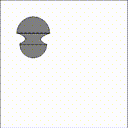
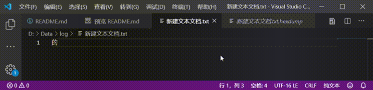
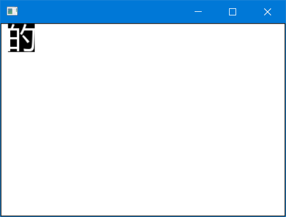
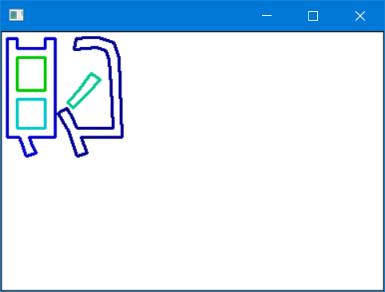
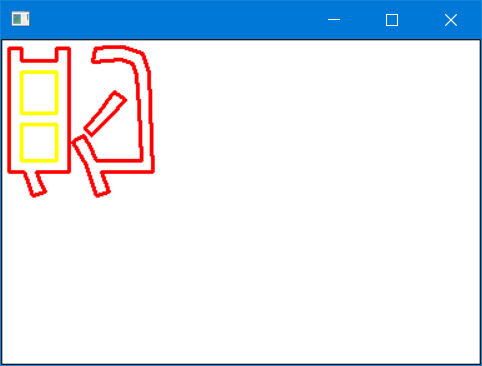
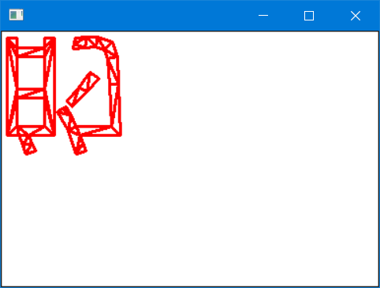
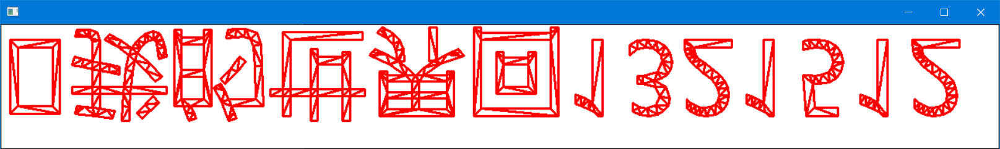
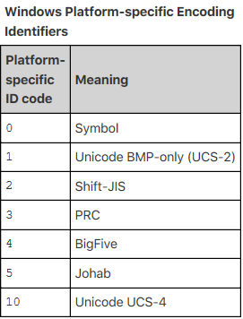
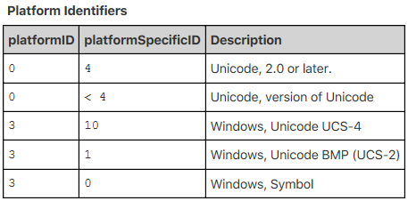
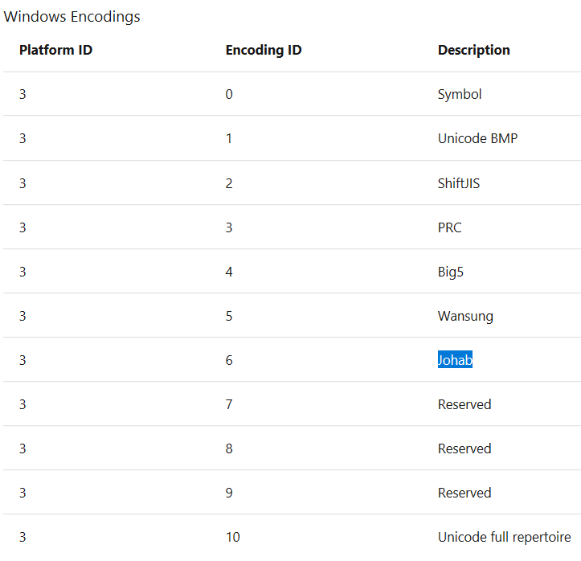

# Project 1
## 贝塞尔曲线

#### 二阶
```
static IntPoint* Bezier(float t, IntPoint p0, IntPoint p1, IntPoint p2) {
	IntPoint * point = new IntPoint();
	float temp = 1 - t;
	(*point).x = temp * temp * p0.x + 2 * t * temp * p1.x + t * t * p2.x;
	(*point).y = temp * temp * p0.y + 2 * t * temp * p1.y + t * t * p2.y;
	return point;
}
```

#### 任意阶
```
static IntPoint BezierN(float t, std::vector<IntPoint>&p, int n, int position) {
	if (n == 1) {
		return ((p[position] * (1 - t)) + (p[position + 1] * t));
	}
	else {
		IntPoint p1 = BezierN(t, p, n - 1, position);
		IntPoint p2 = BezierN(t, p, n - 1, position + 1);
		//IntPoint tmp1 = (p1) * (1 - t);
		IntPoint p3 = (p1) * (1 - t) + (p2)* t;
		return p3;
	}
}
```



# Project 2
## FreeType画一个字的轮廓

#### 查看一个汉字unicode16编码



# Project 3
## FreeType bitmap方式渲染一个字


# Project 4
## FreeType 加入曲线轮廓
```
int moveto(const FT_Vector* to, void* user)
{
	printf("M %d %d\n", to->x, to->y);
	
	return 0;
}

int lineto(const FT_Vector* to, void* user)
{
	printf("L %d %d\n", to->x, to->y);

	return 0;
}


int conicto(const FT_Vector* control,
	const FT_Vector* to,
	void* user)
{
	printf("Q %d %d %d %d\n", control->x, control->y, to->x, to->y);

	return 0;
}

int cubicto(const FT_Vector*  control1,
	const FT_Vector*  control2,
	const FT_Vector*  to,
	void*             user)
{
	
	printf("C %d %d %d %d %d %d\n", control1->x, control1->y, control2->x, control2->y, to->x, to->y);
	return 0;
}

void ExtractOutline(FT_Outline outline)
{
	FT_Outline_Funcs callbacks;

	callbacks.move_to = moveto;
	callbacks.line_to = lineto;
	callbacks.conic_to = conicto;
	callbacks.cubic_to = cubicto;
	callbacks.shift = 0;
	callbacks.delta = 0;
	printf("ExtractOutline \n");
	FT_Error error = FT_Outline_Decompose(&outline, &callbacks, &outline);
	if (error) {
		printf("Couldn't extract the outline: FT_Outline_Decompose() failed");
	}
}
```


# Project 5
## FreeType 使用clipper转化为轮廓树，可以区分外轮廓和内轮廓，挖洞或者渲染


# Project 6
## FreeType 使用clipper转化为轮廓树，使用Poly2Tri转化为三角形



# Project 7
## FreeType 从UTF8文件读取字符
FT_Select_Charmap选择字符集需要字体文件内部有对应的charmap，最好是自己先转好，默认都会有unicode16 LE charmap




字体文件支持的字符集由FT_CharMapRec的platform_id和encoding_id共同决定







[OpenType specification cmap](https://docs.microsoft.com/zh-cn/typography/opentype/spec/cmap)

[OpenType specification cmap](https://developer.apple.com/fonts/TrueType-Reference-Manual/RM06/Chap6cmap.html)

[cmap](http://www.bubfun.com/post/2018/06/30/ttfe69687e4bbb6e4b8adCMAPe8a1a8e7bb93e69e84.aspx)

@预子

